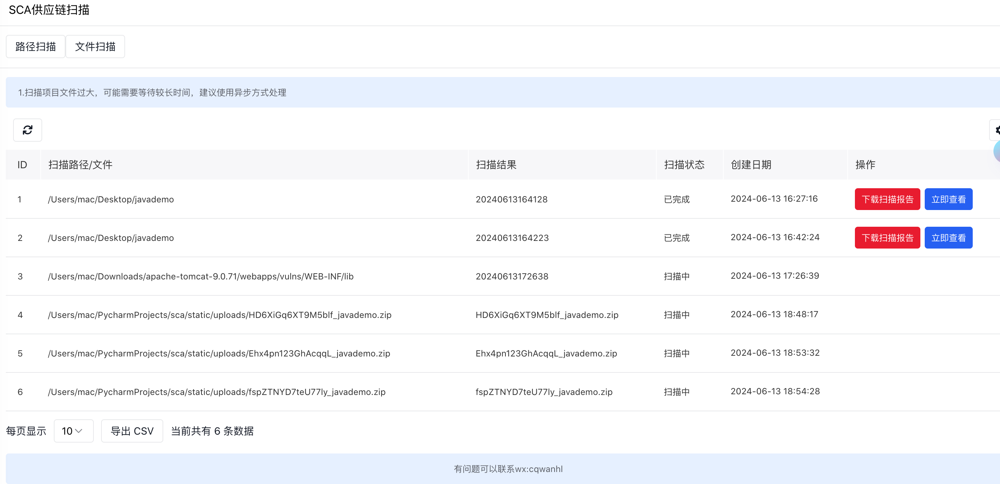
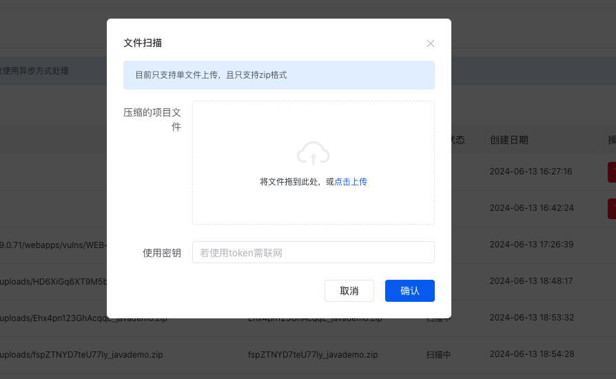
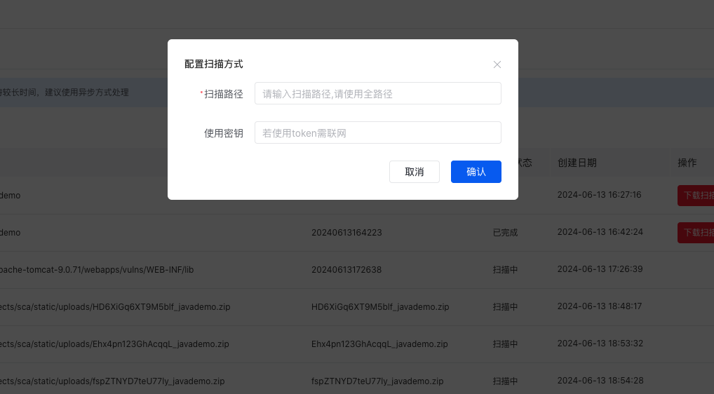
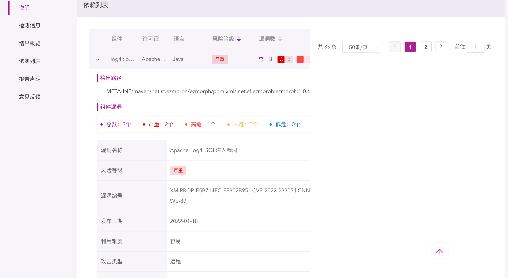

# openSca
一款基于悬镜的openSca-cli且开源的SCA供应链检测系统

# 基于python3 + Amis 开发
仅依赖Flask,requests,celery,pymysql

# 部署方式：
1 下载源码，配置python依赖,可以喧杂国内镜像源 

2 启动服务： python main.py runserver --reload，默认端口7777 

3 当然可以选择supervisor进行部署，根据实际情况自行部署 

4.需要启用celery,来异步处理耗时的扫描任务

5.需要配置crontab,来定时更新扫描任务的状态

# 与DevSecOps对接
将扫描的结果定制成json格式，并提供API服务给到DevSecOps实现对接

# 访问地址：http://localhost:7777/index

页面预览：
  
   
    
     

